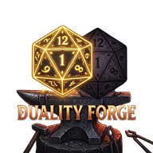

# TODO — Duality Forge 

## ✅ Completed

### Project Structure
- [x] Merged DM tools + character sheet into monorepo
- [x] Consolidated character sheet to single layout
- [x] Consolidated nav actions into kebab menu (DM + character)
- [x] Moved support to shared page, merged character nav into single row
- [x] Split gear and auth into separate nav buttons
- [x] Centralized magic numbers and localStorage keys into constants.js

### Branding & Polish
- [x] New logo and icons
- [x] Project name update (Duality Forge)
- [x] Tab persistence, collapse arrows, support link
- [x] Swap fantasy tab icons (scroll→story, book→compendium)

### Themes & UI Components
- [x] Extracted shared theme module (`js/core/theme.js`) — both DM and Character use same `dh_theme` / `dh_mode` keys
- [x] Removed per-character theme override from cloud save (shared global preference)
- [x] Sci-Fi mode CSS — navy-black palette, scan-line texture, squared corners, steel blue borders
- [x] Fantasy mode CSS — warm browns, amber/copper tones, heavier vignette, cracked stone texture
- [x] Button component class system — 17+ semantic classes (`btn-primary`, `btn-secondary`, `btn-danger`, `btn-nav`, `btn-icon`, `mode-btn`, `menu-item`, `picker-card`, etc.)
- [x] Structural component classes — `input-field`, `input-search`, `select-field`, `dropdown-menu`, `stat-box`, `vitals-row`, `panel-box`, `gear-slot`, `gear-input`, etc.
- [x] Replaced ~175 inline Tailwind instances across HTML and JS with semantic classes
- [x] All 4 mode overrides (dark/light/scifi/fantasy) for every component class in `themes.css`
- [x] Fixed vitals/stat box dark backgrounds bleeding into light mode
- [x] Browser autofill styling fix across all themes

### Compendium & Cards
- [x] Weapons, Armor, Items, Consumables can be added to character sheet from compendium
- [x] All cards in compendium have option to be added to character sheet
- [x] Card collapse, custom styled dialogs

### DM Vault & Groups
- [x] Group options with Deploy All for DM in Vault
- [x] New Character option for DM and Sheet, removed all clear sheet
- [x] Vault clear includes groups, adversary +Add feedback, disposable default on

### Cloud Sync & Storage
- [x] RLS cloud sync
- [x] Landing page auth flow, DM Table with Party option
- [x] Cloud autosave system, unified cloud picker
- [x] Consent on signup, DM nav redesign, title toggle

### Authentication & Account Management
- [x] Password reset from Profile (email users only)
- [x] Forgot password on Sign In modal
- [x] Hide password reset for Google OAuth users
- [x] Change email address
- [x] Session management (sign out from all devices)
- [x] Sign-out redirects to `/` instead of resetting UI in place
- [x] Sign out option on landing page
- [x] Delete account (confirmation modal, cascade cleanup of characters, tables, profile)
- [x] Analytics snapshot on account deletion

### Party System
- [x] Table Party setup (DM creates table, shares code)
- [x] DM and player table linking, DM approval flow
- [x] DM read-only access to party members' character data
- [x] Sign-in gate on Party tab for logged-out users
- [x] Profile DM and Player experience standardized options
- [x] Handle DM table deletion gracefully for linked characters
- [x] Auto-save syncs table approval status (15-min cycle)
- [x] Forced campaign/character picker (no dismiss, back to forge link)

### Legal & Analytics
- [x] Terms/privacy pages, consent gate, updated how-to-use docs
- [x] Google verification, updated analytics
- [x] Cloudflare Web Analytics integration

---

## 🔜 Planned

- [ ] Companion/pet tracker on character sheet (HP, abilities, notes)

### Community Sharing (`/community/`)
Dedicated page for browsing, rating, and importing community-created content. Accessible from the landing page and contextually from existing tools.

#### ✅ Done
- [x] **DB schema** — `community_chapters`, `community_ratings`, `community_imports` tables with RLS, indexes, auto-updated avg_rating trigger, CASCADE deletes
- [x] **Share from Chronicle** — 🌐 share button per chapter, metadata modal (title, description, level range, party size, environment, difficulty, duration), consent gate linking to Terms of Use
- [x] **Share validation** — all metadata fields required (title, description 3+ words, environment, difficulty, duration) + consent before Share enables
- [x] **Browse page** — `/community/` with search, filter (environment, difficulty, duration), sort (newest, top rated, most imported), preview modal with full content/NPCs/music, star rating, import to Chronicle
- [x] **My Shares tab** — manage own shared chapters with edit (Quill rich text + NPCs + music + metadata), delete, stats (ratings, import count)
- [x] **Version system** — auto-increments on content change (no cap), metadata-only edits don't bump version
- [x] **Duplicate prevention** — same author can't share two chapters with the same title
- [x] **Account deletion** — shared content anonymized to "Unknown" author; imported copies unaffected
- [x] **Sharing consent gate** — one-time acknowledgment when first sharing
- [x] **Legal update** — Terms of Use Section 5 (Community Sharing) with anchor `#community-sharing`
- [x] **Landing page** — Community card added
- [x] **Import flow** — everyone is a customer (including author); import always creates a new chronicle entry with version in title; 4-second toast confirmation; sign-in required
- [x] **Import update notifications** — Chronicle checks imported chapters against DB versions on load; dismissible version-aware "Update available" badge; reappears if author publishes newer version beyond dismissed
- [x] **Encoding fix** — fixed 29 double-encoded UTF-8 characters (stars, arrows, emoji) in community app.js
- [x] **Theme/mode support** — Community page initializes saved display mode (dark/light/scifi/fantasy) and accent color on load; all component classes theme-compatible
- [x] **Nav standardization** — Community header matches DM layout (logo left, tabs center, auth right); uses `modern-tab-btn` class; added `modern.css`
- [x] **Duration options** — Short (1hr), Medium (2-3hr), Long (4-6hr), Extra Long (8hr+) across share modal, community filters, and edit modal
- [x] **Quill theme overrides** — per-mode canvas: light (white bg, dark text), dark (dark bg, light text), scifi (navy bg, steel text), fantasy (warm dark bg, parchment text); toolbar icons adapt; user-picked colors render as-is

#### 🔜 Next

#### 📋 Future
- [ ] **Homebrew Cards** — card builder for custom domain cards, subclasses, classes, ancestries, communities; publish to community library; DMs can approve homebrew for their table
- [ ] **Custom Adversaries** — DMs publish custom adversaries for others to browse and import into their vault
- [ ] Contextual access — "Browse Community" links from Compendium and Adversary tabs
- [ ] Compendium toggle — option to show community homebrew alongside SRD data
- [ ] DM table integration — DM curates and approves community content for party use

---

## 💡 Ideas / Someday

_Brainstorm space — no commitment, just possibilities._

- **Account Linking** — link Google account to existing email account (or vice versa) to unify data under one identity
- **Party Message Board** — a simple board for DMs and players to post updates within the app _(low priority — most groups already use Discord, etc.)_
- **Table Scheduling** — DM sets a session schedule, players and DM receive email reminders _(high effort — requires email integration and additional infrastructure)_
